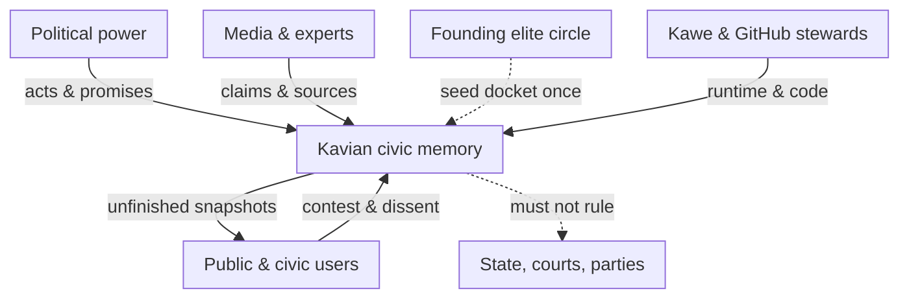
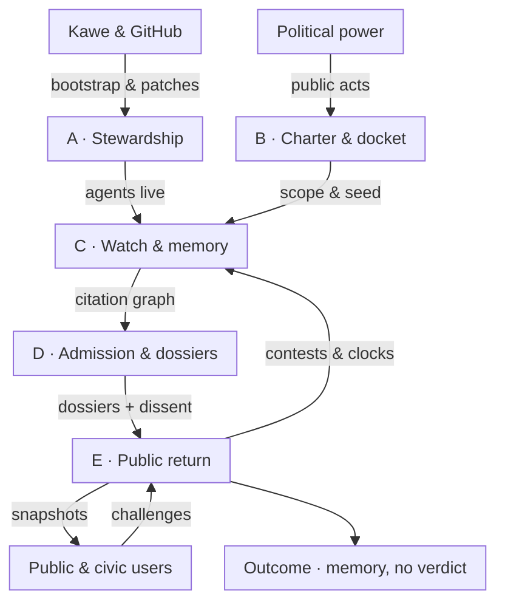
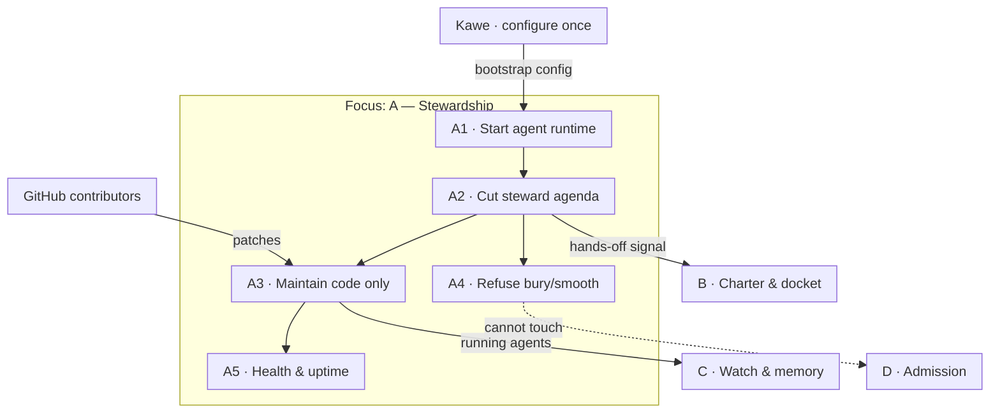
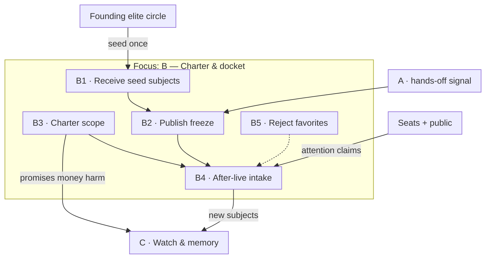
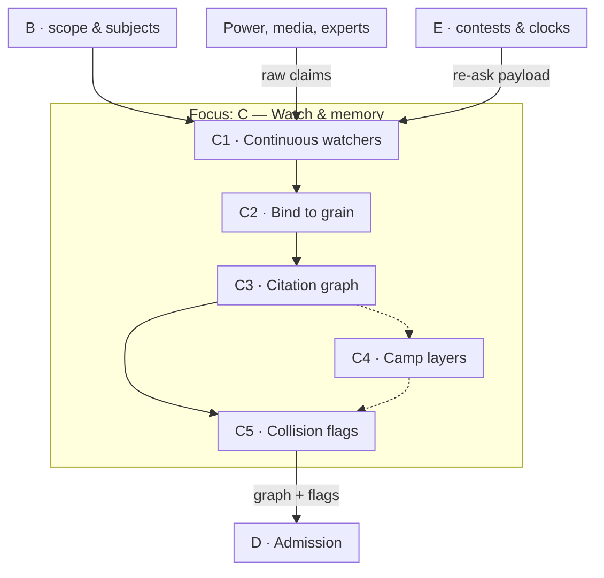
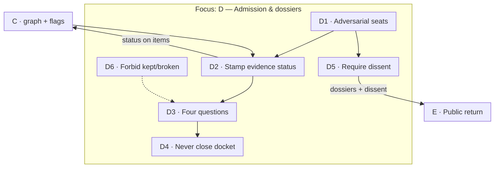
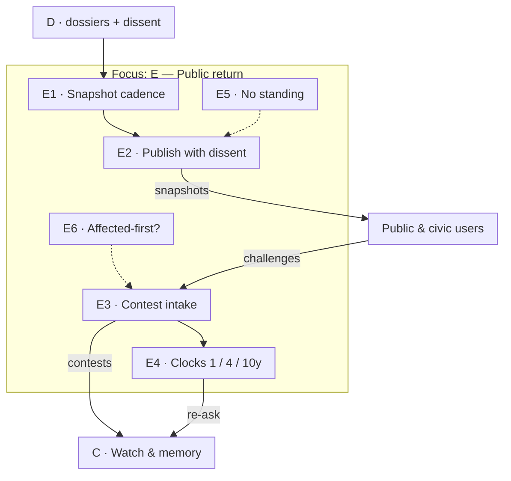
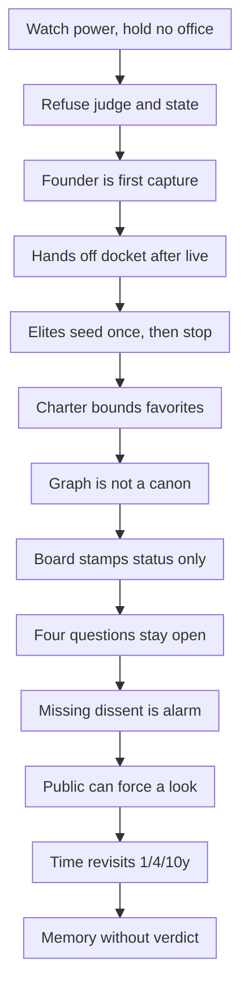
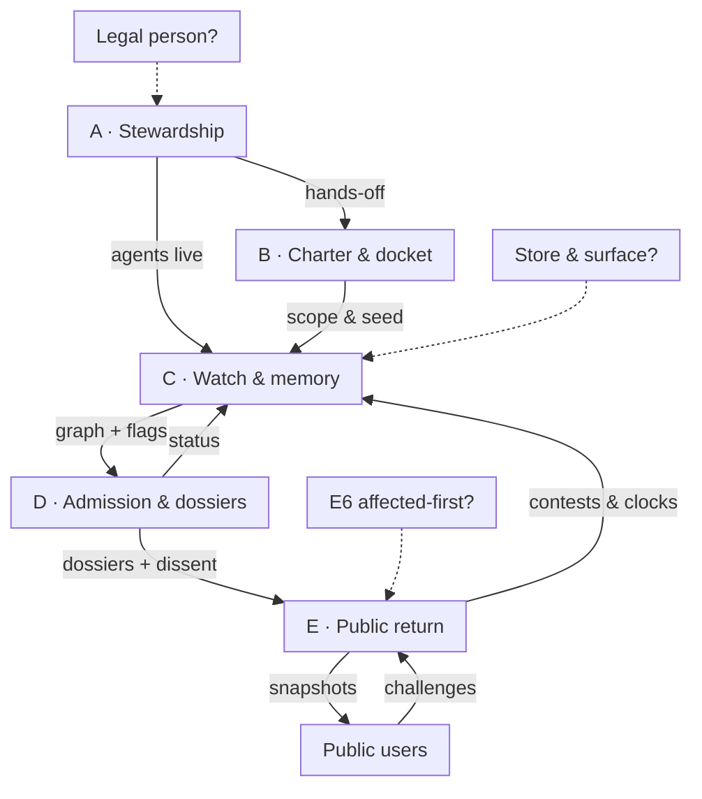

# Kavian — civic memory that watches power without taking it

Page size: **A4 Portrait 210×297 mm**. Chat SVG is a layout contract, not print-accurate.

---

## E0

**E0 · Environment**  
**Goal:** One system that watches power and must not become power.

| Node | Purpose | In | Action | Out | Owner | Success / failure |
|---|---|---|---|---|---|---|
| Political power | Environment to watch | — | Exercises office | Acts, promises | Those in office | — |
| Media & experts | Source environment | Events | Publish claims | Citations | Outsiders | Not treated as canon |
| Founding elites | Seed once | Prior discussion | Propose first subjects | Founding docket | Named circle | Failure: set agenda forever |
| Kawe & stewards | Bootstrap & keep lights | Intent, PRs | Configure, then code only | Running agents | Kawe + GitHub | Failure: bury dissent |
| **Kavian** | Watch without office | Acts, claims, contests | Remember & ask | Snapshots, no verdict | Process, not a bench | Failure: judge or capture |
| Public & civic users | Consume & contest | Snapshots | Use, challenge, dissent | Contests | Anyone | Failure: only elites speak |
| State / courts / parties | Must stay outside | — | Their own power | — | Themselves | Kavian has **no standing** |

**Register:** Confirmed — not a government, not a judge. Dashed — elite seed ends; no standing toward the state.

**Footer:** Solid = primary · dashed = optional/forbidden-as-power · **A4 P · E0/9** · stack: humans + agents, not an office

---

## P1

**P1 · Backbone**  
**Goal:** Highest units of a counter-institution that publishes memory, never verdicts.

| Unit | Purpose | In | Out | Owner |
|---|---|---|---|---|
| **A Stewardship** | Start agents; then hands off agenda | Config, PRs | Runtime; freeze signal | Kawe + GitHub |
| **B Charter & docket** | Bound what may be watched | Elite seed once; charter | Frozen seed + scope | Charter; seats after live |
| **C Watch & memory** | Continuous remember | Acts, claims, contests | Citation graph | Agents as clerks |
| **D Admission & dossiers** | Stamp status; keep asking | Graph, board, dissent | Living dossiers | Rotating adversarial board |
| **E Public return** | Publish without standing | Dossiers + dissent | Snapshots; loops | Public + board cadence |

**Lineage:** A→P2-A · B→P2-B · C→P2-C · D→P2-D · E→P2-E · all P2→P3

**Register:** Outcome is unfinished public memory. Feedback is contests + clocks into C, not a score.

**Footer:** Confirmed ranks · default grain on C/D · **A4 P · P1/9** · 4-word payloads

---

## P2-A

**P2-A · Stewardship**  
**Goal:** Founder power ends at go-live. Technology may continue; the docket may not.

| ID | Purpose | In | Action | Out | Owner | Success / failure |
|---|---|---|---|---|---|---|
| A1 | Bring agents up | Config | Launch watchers | Runtime | Kawe | Up vs never live |
| A2 | End founder agenda | Go-live | Revoke docket rights | Hands-off | Bylaw | Failure: silent override |
| A3 | Keep machine honest | PRs | Patch, deploy | Same contracts | GitHub | Failure: logic that buries |
| A4 | Protect dissent | Pressure | Refuse | No-op | Stewards | Success = cannot comply |
| A5 | Stay alive | Runtime | Monitor | Alerts | Stewards | Failure: quiet death |

**Register:** Confirmed — stewards are code-only after live. Default — same-cycle code mergers cannot sit on the board.

**Footer:** Focus A · parent outs to B/C · dashed = forbidden reach · **A4 P · P2-A/9**

---

## P2-B

**P2-B · Charter & founding docket**  
**Goal:** Elites may seed once. After live, attention is public + seats, inside a written scope.

| ID | Purpose | In | Action | Out | Owner | Success / failure |
|---|---|---|---|---|---|---|
| B1 | Take first list | Elite ideas | Record as seed | Draft docket | Elites, once | Failure: secret list |
| B2 | Freeze in public | Seed + go-live | Publish, lock stewards | Frozen seed | Process | Failure: quiet adds |
| B3 | Bound the watch | Values | Hold scope | Scope contract | Charter | Failure: favorite topics |
| B4 | Open attention | Contests, seats | Admit subjects in scope | New dockets | Board + public | Failure: steward queue |
| B5 | Block cliques | Steward/elite asks | Refuse | — | Bylaw | Success = no |

**Charter scope (default):** public promises, decisions, money, outcomes, harm.  
**Not in scope:** what should happen next; ranking actors; scoring “truth.”

**Register:** Confirmed — 1 then 3 from Q6. Open — how freeze is published.

**Footer:** Focus B · **A4 P · P2-B/9** · dashed B5 = control

---

## P2-C

**P2-C · Watch & citation memory**  
**Goal:** Agents clerk a graph. Nothing is true because it was repeated.

**Grain (default):** docket = one promise or decision · children = claims, evidence items, outcome observations.

| ID | Purpose | In | Action | Out | Owner | Success / failure |
|---|---|---|---|---|---|---|
| C1 | Not forget | Acts, claims, revisits | Fetch, attach time | Raw bundle | Agents | Failure: idle watch |
| C2 | Keep grain | Bundle | File under docket | Claims/items | Agents | Failure: slurred blobs |
| C3 | No canon | Items | Link who-said-what | Graph | Agents | Failure: merge to “fact” |
| C4 | Plural memory | Camps | Parallel admitted-sets | Layers | Camps | Optional at v0 |
| C5 | Show clash | Graph, layers | Flag collision | Flags | Agents | Failure: hide clash |

**Register:** Confirmed — citation graph under the board. Default — official gazette is a source node, not truth. Open — store/runtime.

**Footer:** Focus C · camp dashed · **A4 P · P2-C/9**

---

## P2-D

**P2-D · Admission & living dossiers**  
**Goal:** The board is clerical. The four questions stay open. Missing dissent is the alarm.

| ID | Purpose | In | Action | Out | Owner | Success / failure |
|---|---|---|---|---|---|---|
| D1 | Prevent one church | Cohort rules | Seat opposition | Seated board | Bylaw | Failure: tame opposition |
| D2 | Clerical power only | Graph | Stamp A/C/U | Status | Board | Failure: moral stamp |
| D3 | Civic product | Status + graph | Ask four questions | Living dossier | Agents + board | Failure: answer instead |
| D4 | Long horizon | Time | Refuse close | Still open | Process | Failure: settled case |
| D5 | Capture alarm | Draft snapshot | Block if no dissent | Dissent record | Board | Failure: unanimous quiet |
| D6 | Stay off the bench | Urge to verdict | Refuse | — | Charter | Success = no verdict |

**Four questions (confirmed):** What was promised? What happened? Who benefited? What evidence?

**Status vocabulary (confirmed):** admitted / contested / unverified — reopenable by later board, dissent, or new primary source.

**Register:** Default v0 board = named plural cohort; not sitting officials, sponsors, or same-cycle merge authors.

**Footer:** Focus D · **A4 P · P2-D/9** · dashed = forbidden verdict

---

## P2-E

**P2-E · Public return**  
**Goal:** Others may use the evidence. Kavian has no standing. Reality can force another look.

| ID | Purpose | In | Action | Out | Owner | Success / failure |
|---|---|---|---|---|---|---|
| E1 | Cadence not agenda | Dossiers | Cycle publish | Draft | Board rhythm | Failure: newsroom capture |
| E2 | Public instrument | Draft + dissent | Release | Snapshot | Board | Failure: missing dissent |
| E3 | Anyone may force look | Challenge | Triage to classify | Contest payload | Public + agents | Failure: elite-only queue |
| E4 | Stop freeze | Time | Re-ask four questions | Revisit | Agents + board | Silence = failure |
| E5 | No office | Urge to sue/rule | Refuse standing | — | Charter | Success = unused as court |
| E6 | Harm standing | Affected person | ? reopen | ? | Open | Not designed |

**Register:** Confirmed — seats, then public contest, then clocks. Open — affected-first (E6). Default — harm uses E3.

**Footer:** Focus E · `?` = open · **A4 P · P2-E/9**

---

## R1

**R1 · Why this shape**  
**Title:** A civic memory that refuses the bench

**Boundary reasons (not a private chain of thought):**

- **Counter-institution before legal person** — cadence, seats, and bylaws can exist while GitHub + agents run; a nonprofit board is a later capture surface, so it is last.
- **Witness as floor** — ranking, truth scores, and “what should happen” would make Kavian a rival authority.
- **Living dossiers, not kept/broken** — a closure stamp is the thing worth capturing; unfinished questions stay humane and non-ideological.
- **Admission ≠ truth** — rotating adversarial seats classify evidence; the citation graph underneath keeps repetition from becoming reality.
- **Hands-off after bootstrap** — Kawe must be unable to add, bury, or smooth dissent once agents run; otherwise stewardship is the ideology.
- **Return order** — missing dissent first (capture inside), public contest second (capture of agenda), clocks third (capture by freeze).

**Confidence:** Architecture is ready to implement as process + agents. Jurisdiction, first cohort names, and store are still open.

**Footer:** R1 justification · 2-col stack · **A4 P · R1/9**

---

## P3

**P3 · One-page blueprint**  
**Goal:** Dependencies only. Confirmed / default / open on this sheet.

**Lineage check:** P2-A..E expand A..E with no new powers. No kept/broken. No steward docket. No standing.

### Confirmed
- Name: Kavian (کاویان). Watch power; do not take it. Not a government or judge.
- Ranked boundary: counter-institution practice → public instrument → plural ledger → witness floor.
- After bootstrap: stewards = code only; founding docket then hands off; charter-scope second fence.
- Board: rotating, adversarial; status only; required dissent on snapshots.
- Product: living dossiers (four questions); citation graph; public contests; 1/4/10y revisits.

### Design defaults
- Grain: docket per promise/decision; claims, evidence, outcome observations.
- v0 board: named plural cohort; not officials, sponsors, or same-cycle mergable authors.
- Camp layers optional at v0. Affected-first off; harm via public contest.
- Legal person late. GitHub + running agents + bylaws enough to start.
- Success: reopenable dossiers; dissent never missing; steward hands off the docket.

### Open
- First jurisdiction and language of watch.
- Named first adversarial cohort; public freeze of the elite seed.
- Memory store, runtime, public read surface, cost/scale/compliance.
- Affected-first standing (E6). Legal person (dashed). Camp visibility on day one.

**Footer:** Solid = primary · dashed/`?` = open · **A4 P · P3/9** · print frame for geometry
