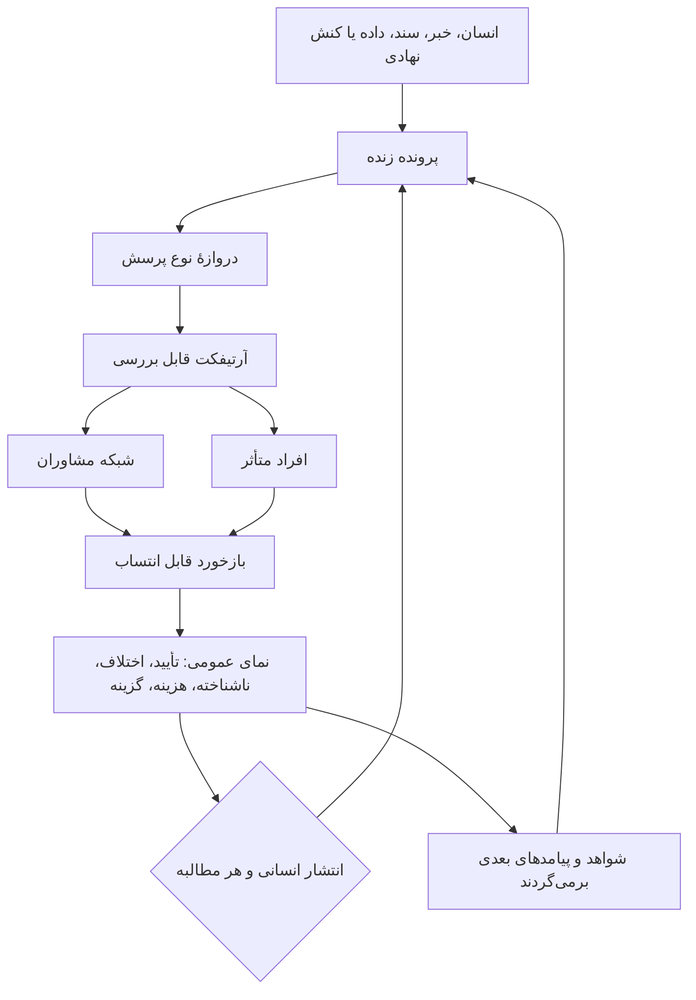

# کاویان — معماری به‌هم‌دوخته برای چرخهٔ بعدی طراحی

**تاریخ:** ۲۲ سپتامبر ۲۰۲۶  
**وضعیت:** گردش طراحی. ارائهٔ نهایی [`proposal-deck.html`](./proposal-deck.html) است؛ این فایل اسکریپت اسلاید نیست. نه سامانهٔ مستقر است و نه شبکهٔ مشاورانِ گردآمده.  
**همراه با:** [مرجع کار](./REFERENCE.md)، [مفهوم انگلیسی](../concept/kavian-concept-en.md)، [مفهوم فارسی](../concept/kavian-concept-fa.md)

گفت‌وگو تکه‌تکه رسید: هدف عمومی، لایهٔ فنی، لایهٔ مدل، شبکهٔ مشاوران، و فرستادن آرتیفکت برای نقد. این سند محل اتصال آن‌هاست. ارائهٔ فعلی و هر نمونهٔ بعدی باید بتوانند به همین گردش برگردند و بگویند کدام بخش را دارند می‌آزمایند.

## ۱. وعده، به‌صورت آزمونی که یک انسان بتواند به کار ببرد

کاویان برای این است که آدم با یک تصمیم عمومی روبه‌رو شود و چیزی بیشتر از تیتر، و چیزی کمتر از حکمِ صادرشده از بالا، در دست داشته باشد.

اگر عبور از سیستم موفق باشد، آن آدم می‌تواند بگوید:

- چه ادعایی مطرح است و امروز کدام منابع آن را پشتیبانی می‌کنند
- چه کسی سود می‌برد، چه کسی هزینه می‌دهد، و تجربهٔ چه کسی هنوز غایب است
- اهلِ کار کجا اختلاف دارند و اختلافشان از چه نوع پرسشی است
- گزینه‌های دیده‌شده چیست و هر کدام چه هزینه و چه فرضی دارد
- چه چیزی این روایت را عوض می‌کند و چطور می‌شود به آن اعتراض کرد

تصمیم با خودِ آدم می‌ماند. مشاوران تصویر را عمیق‌تر می‌کنند. مدل‌ها کاری را جلو می‌برند که شکلش از قبل تعریف شده باشد. کاویان بعداً می‌تواند توضیح بدهد، پیشنهاد بدهد و مطالبه‌گری کند؛ و هر بار که این کار را بکند، یک انسانِ مشخص مالک آن کنش است.

اولین جامعه‌ای که این گردش باید به دردش بخورد مردم ایران‌اند: دسترسی به شواهد، دیدن گزینه‌ها، و دیدن هزینهٔ هر انتخاب. همین گردش باید بتواند از جوامع دیگر هم یاد بگیرد، بی‌آنکه مقوله‌های یک جا را معیار همهٔ جاها کند.

## ۲. یک گردش

هیچ بخشی از این حلقه اجازه ندارد از دروازهٔ نوع پرسش رد شود بدون آنکه نوع پرسش نامیده شده باشد. خوراک خام امتیاز نمی‌شود. اطمینان مشاور، انتخاب مردم نمی‌شود. احتمالِ یک مدل، احتمالِ منصفانه‌بودنِ توصیف یک زندگی نمی‌شود.

شش مسئولیت این حلقه را با هم نگه می‌دارند. این‌ها ظرفیت‌اند و نباید در چارت سازمانی به یک گرداننده فروکاسته شوند.

| مسئولیت | چه چیزی می‌آورد | به چه چیزی نباید بدل شود |
|---|---|---|
| مشارکت عمومی | مسئله، تجربه زیسته، شاهد، اعتراض، پیگیری | جعبهٔ نظری که بر پرونده اثری ندارد |
| شواهد و حافظه | منشأ، نسخه، اصلاح، پیامد در طول زمان | بایگانیِ پاک‌نشدنیِ جزئیات شخصی |
| ماشین‌ها | جست‌وجو، استخراج، مقایسه، مسیردهی، پیش‌نویس، ردپا | مرجع، فقط چون کارشان منظم بوده است |
| شبکه مشاوران | دانش، نقد و قضاوت سنجیده روی همان آرتیفکت | هیئت نهایی، یا طبقه‌ای بالای مردم |
| انتشار و کنش | روایت خوانا، گزینه، و در صورت انتخاب، مطالبه‌گریِ پاسخگو | سخن‌گفتن به نام «همهٔ مردم» |
| حکمرانی خود کاویان | قاعده، اعتراض، حد قدرت بنیانگذار و حامی و گرداننده | کلید پنهان برای اینکه چه پرسشی مجاز است |

## ۳. دروازهٔ نوع پرسش

پیش از آنکه آرتیفکتی مسیردهی شود، امتیاز بگیرد یا وارد دور دلفی شود، پرونده باید بگوید چه نوع پرسشی واقعاً باز است. یک موضوع اغلب بیش از یک نوع پرسش دارد. این نوع‌ها برچسب خود را حفظ می‌کنند، چون جوابشان از راه‌های متفاوت به دست می‌آید.

| نوع پرسش | چه چیزی آن را جلو می‌برد | چه چیزی پیش مردم می‌ماند |
|---|---|---|
| اعتبار یک ادعای واقعی | منبع، روش، تکرار بررسی، و ثبت آنچه منبع ثابت نمی‌کند | حق آوردن شاهد غایب و اعتراض به صورت‌بندی |
| برآورد در عدم‌قطعیت | قضاوت ساختاریافته، فرض‌های آشکار، بازه، و حساسیت نتیجه به آن فرض‌ها | حق دیدن بازه و فرض‌ها، و رد دقتِ دروغین |
| ترجیح اجتماعی یا اخلاقی | مشارکت عمومی، به‌ویژه کسانی که با نتیجه زندگی می‌کنند | این امتیاز کارشناسی نیست. مشاور پیامد را روشن می‌کند و ارزش جمعی را تعیین نمی‌کند |
| اقدام پیشنهادی | مالک انسانیِ مشخص، دلیل، هزینهٔ محتمل، و مسیر اصلاح | حمایت، رد، یا اصلاح آن اقدام |

این دروازه صفحهٔ کنترل همهٔ ابزارهایی است که تا اینجا نام برده شده‌اند. دلفی سیاستی، مقایسهٔ چندمعیاره و تحلیل حساسیت برای وقتی‌اند که پرونده به برآورد یا گزینه رسیده باشد. برای خبر تازه‌ای که هنوز منبع ندارد، ابزار نامناسبی‌اند. Jev، اگر آزموده شود، درون گام‌های ساختاریافته و ازپیش‌تعریف‌شده می‌نشیند. روی ردیف ارزش‌ها نمی‌نشیند.

## ۴. آرتیفکت

آرتیفکت شیئی است با مرز مشخص که یک انسان بتواند به آن جواب بدهد. از خبر، سند، داده و روایت مردمی، درون پروندهٔ زنده ساخته می‌شود. واحد کار است، و پرونده بعد از آن همچنان قابل بازنگری می‌ماند.

شکل‌های ممکن، که هنوز مجموعهٔ نهایی نیستند:

- یک ادعا و شواهد له و علیه آن
- خط زمان وعده، تصمیم و نتیجهٔ دیده‌شده
- مقایسهٔ روایت‌های ناسازگار
- فهرست پرسش‌های باز
- برگهٔ گزینه‌ها با هزینه، فایده و کسانی که غایب‌اند

حداقل فیلدها برای اولین نمونهٔ اولیه:

| فیلد | چرا به درد آدم می‌خورد |
|---|---|
| پرونده و نسخه | تا اصلاح بعدی، روایت قبلیِ عمومی را پاک نکند |
| ادعا به زبان روشن | تا موضوع بررسی صریح باشد |
| نوع پرسش | تا تعارض ارزشی، راستی‌آزماییِ واقعیت فرض نشود |
| منابع، و آنچه هر منبع ثابت نمی‌کند | تا غیاب دیده شود |
| عدم‌قطعیت و پرسش‌های باز | تا صفحه‌آراییِ تمیز، قطعیت جعل نکند |
| پیش‌نویس از انسان بوده یا عامل | تا کمک ماشین قابل انتساب بماند |
| پرسشی که از بازبین خواسته می‌شود | تا به مشاور انبوه خام ندهیم و نگوییم «نظرت را بگو» |
| مسیر اعتراض | تا فرد متأثر بی‌عنوان مشاور وارد شود |

مسیردهی تابع پرسش است، تابع صلاحیتی که آن پرسش می‌خواهد، و تابع نیاز به دیدگاه‌های متفاوت. شهرت و نزدیکی به گردانندگان حقِ دریافت آرتیفکت ایجاد نمی‌کند. یک آرتیفکت ممکن است به یک مشاور برسد یا به چند مشاور. تعارض منافع نقش را در همان آرتیفکت محدود یا حذف می‌کند.

آنچه برمی‌گردد قابل انتساب است: موافقت، اعتراض، منبع جاافتاده، حد دانش بازبین، یا رد خودِ پرسش. بازخورد به آرتیفکت وصل می‌ماند و، تا جایی که امنیت و حریم خصوصی اجازه دهد، به شواهدی که درباره‌شان حرف می‌زند.

## ۵. شبکهٔ مشاوران

نام کاری: **شبکهٔ مشاوران**. قرار است نامی معمولی باشد. یعنی این آدم‌ها کارشان را بلدند. آن‌ها را بالای مردم نمی‌نشاند و نقششان را به مهر نهایی کوچک نمی‌کند.

ممکن است پژوهشگر، اقتصاددان، جامعه‌شناس، نویسنده، ادیب، روشنفکر، متخصص فنی، کنشگر اجتماعی و هر کس دیگری باشند که دانش یا تجربه‌اش به همان پرسش مربوط است. تفاوت جهان‌بینی بخشی از طراحی است. خواندنِ زبان عمومی توسط یک نویسنده، و خواندن بودجه توسط یک اقتصاددان، هر دو ممکن است لازم باشند و از یک جنس اقتدار نیستند.

افراد متأثر درِ جدا دارند. روایتشان شاهد و زمینه است. منتظر نمی‌ماند تا کسی عنوان مشاور به آن‌ها بدهد.

«دیدگاه کامل» یعنی روایت صادقانه از آنچه معلوم است، محل اختلاف است، و هنوز مجهول است. یعنی این نیست که هر عقیده‌ای وزن شواهدی یکسان دارد، یا سیستم همه‌چیز را دیده است.

## ۶. ماشین‌ها کجا اجازهٔ کار دارند

کاوه لایهٔ فنی را چنین وصف کرده است: سیستم چندعاملی؛ LangChain و LangGraph برای جریان کار؛ LangSmith و Langfuse برای مشاهده‌پذیری و ارزیابی؛ اجرا روی Vercel؛ کد در GitHub؛ و کار قابل‌توجه روی مشاهده‌پذیری. این روایت معماریِ اوست. این پوشه مخزن، استقرار و ردپاها را بازرسی نکرده است. زبان ارائه باید همین تمایز را نگه دارد.

نقش‌های پیشنهادی عامل‌ها، به‌عنوان متصدیانی با کار محدود:

| عامل | کار | کجا می‌ایستد |
|---|---|---|
| کاتب | ورود، منشأ، پیش‌نویس اول آرتیفکت | درست‌بودن ادعا را اعلام نمی‌کند |
| مسیرده | تطبیق آرتیفکت با نوع پرسش و بازبین مناسب | ترجیح عمومی را انتخاب نمی‌کند |
| آینه | چیدن بازخورد کنار هم: تأیید، اختلاف، مجهول، و نوع اختلاف | موضع‌ها را به یک صدا میانگین نمی‌کند |
| ترجمان | توضیح به زبان روشن، از جمله فارسی و بعداً زبان‌های دیگر | جایگزین آرتیفکتِ منبع‌دار نمی‌شود |
| نگهبان | نسخه، ردپا، و حذف جزئیات آسیب‌زا | به نام شفافیت، امر خصوصی را منتشر نمی‌کند |

مدل‌های زبانی، و در صورت تناسب مدل‌های باز، به جست‌وجو، استخراج، ترجمه، مقایسه و توضیح کمک می‌کنند. Jev از TypeSafe AI نامزدی است برای گام‌های ساختاریافته با نوع پاسخ ازپیش‌تعریف‌شده و یک احتمال: دسته‌بندی، مسیردهی، امتیازدهی بر معیارهای اعلام‌شده، یا علامت‌زدن برای بازبینی انسانی. ادعاهای سازنده دربارهٔ سرعت، هزینه و کالیبراسیون تا وقتی روی زبان و داده و پرسش‌های واقعی کاویان آزموده نشده‌اند، ادعای فروشنده‌اند. Jev سرویس میزبانی‌شده و دارای مجوز است. احتمال خروجیِ آن، خروجیِ مدل روی یک کار تعریف‌شده است. نه حکم به درستی یک گزارش است و نه بهترین تصمیم برای یک مردم.

مشاهده‌پذیری در این پروژه به یک پرسش مدنی جواب می‌دهد: کدام نسخهٔ منبع، کدام عامل، کدام مدل، کدام ویرایش انسانی، کدام اختلاف، و کدام اصلاح بعدی، روایتی را ساخته که آدم دارد می‌خواند. همین سابقه اگر مشارکت‌کنندهٔ آسیب‌پذیر، شاهد خصوصی، یا جزئیات حساس امنیتی را لو بدهد، خودش آسیب است. ردپای عمومی، ردپای مشاور، و ردپای ناظر سه نما از یک تاریخ‌اند. اینکه هر کدام چه می‌بیند هنوز سؤال طراحی است. پیش‌فرض مفید این است که تاریخ ادعاهای نهادی و اصلاح‌های محتوایی بماند، و جزئیات شخصی‌ای که برای پاسخگویی لازم نیست دائمی نشود.

اجزای باز، امید به بازرسی و جایگزینی را تقویت می‌کنند. خودبه‌خود کاویان را مستقل، بی‌طرف یا ممیزی‌شده نمی‌کنند. LangChain و LangGraph متن‌بازند. هستهٔ Langfuse متن‌باز و قابل میزبانی مستقل است و امکاناتی تجاری دور آن هست. کیت توسعهٔ LangSmith متن‌باز است؛ خود پلتفرم LangSmith را نباید متن‌باز خواند. Vercel و GitHub و Jev خدمات بیرونی‌اند. استقلال باید در قطعات قابل‌تعویض، تصمیم‌های دیده‌شدنی، حاکمیت داده، و راه اعتراض به گردانندگان نشان داده شود.

## ۷. آنچه به دست آدم می‌رسد

نمای عمومی پرونده، به‌عنوان شیئی که ارائه باید بتواند نشانش بدهد:

۱. **فعلاً شواهد این را پشتیبانی می‌کند…** با منبع و نوع ادعا.  
۲. **این محل اختلاف است…** با هر موضع، دلیلش، و اینکه نزاع بر سر داده است یا تفسیر یا ارزش.  
۳. **این هنوز مجهول است…** از جمله تجربهٔ کسی که شنیده نشده.  
۴. **چه کسی سود می‌برد، چه کسی می‌پردازد، چه کسی غایب است.**  
۵. **اگر پرونده به گزینه رسیده باشد…** هر گزینه با معیار، فرض، و میزان حساسیت مقایسه به آن وزن‌ها.  
۶. **چه چیزی این روایت را بازنگری می‌کند.**  
۷. **چطور می‌شود اعتراض کرد،** از جمله مسیری که مشاورشدن لازم ندارد.  
۸. **اگر کاویان اقدامی را پیشنهاد یا پشتیبانی کند…** مالک انسانی، دلیل‌ها، آسیب محتمل، و مسیر اصلاح.

اختلافی که از بررسی جان به در ببرد دیده می‌ماند. توافق بعد از بررسی ممکن است. اختلاف ساختگی شرط انتشار نیست. سکوت کسانی که هرگز دعوت نشده‌اند، توافق نیست.

## ۸. یک نمونهٔ داستانی، فقط برای دیدن اتصال

این صحنه تصویر گردش است. یافتهٔ کاویان نیست، ادعایی دربارهٔ یک شهر واقعی نیست، و موضوع اجباری ارائه هم نیست. آب در بایگانی یک مثال اولیه است، نه تعریف سرویس.

> نهاد حمل‌ونقل افزایش کرایه را اعلام می‌کند و می‌گوید پول صرف ادامهٔ خطوط می‌شود. مسافران می‌گویند سرویس محله‌های بیرونی همین حالا نازک شده است. جدول بودجه و جدول زمان‌بندی یک چیز نمی‌گویند.

دروازهٔ نوع پرسش موضوع را جدا می‌کند:

- **واقعی:** جدول بودجه چه می‌گوید، زمان‌بندی چه می‌گوید، مسافران چه گزارش می‌کنند، و این ثبت‌ها کجا تعارض دارند.
- **برآورد:** سطح خدمت سال بعد، زیر برنامهٔ منتشرشده، با بازه و فرض‌های نام‌برده.
- **ارزش:** آیا این توزیع هزینه و دسترسی پذیرفتنی است. مشاوران می‌توانند روشن‌اش کنند. تعیین‌اش نمی‌کنند.
- **اقدام:** هر پیشنهاد بعدی — مثلاً مطالبهٔ دادهٔ جاافتادهٔ خطوط — مالک انسانی دارد.

آرتیفکت‌ها: برگهٔ ادعای توجیه رسمی، برگهٔ مقایسهٔ بودجه و زمان‌بندی و روایت مسافران، فهرست پرسش‌های باز (چه کسی سفر را از دست داده، کدام محله، پارسال چه وعده داده شده بود).

برگهٔ مقایسه به سه مشاور می‌رسد: کسی که بودجهٔ عمومی را می‌خواند، کسی که عملیات حمل‌ونقل را می‌شناسد، و کسی که می‌تواند بگوید زبان رسمی حذف سرویس را پنهان کرده است یا نه. مسافری از محلهٔ متأثر می‌تواند تجربهٔ غایب را بیاورد بی‌آنکه عضو آن جمع سه‌نفره شود. عامل آینه پاسخ‌ها را کنار هم می‌چیند. اگر بر سر حساب اختلاف باشد، مسئله شواهد است. اگر بر سر این باشد که پیاده‌روی طولانی‌تر بهای قابل قبولی است یا نه، مسئله ارزش است و با همان برچسب می‌ماند.

Jev در این نمونه فقط می‌تواند به مسیردهی برگه‌ها کمک کند، یا روی یک سنجهٔ ازپیش‌تعریف‌شده علامت بزند که بودجه و زمان‌بندی ناسازگارند. ترجمان، نمای عمومی را به زبان روشن می‌نویسد. نگهبان نسخه‌ای را که مردم دیده‌اند ذخیره می‌کند، و اگر نهاد جواب بدهد نسخهٔ بعدی را هم. خواننده می‌تواند تشخیص بدهد چه چیز منبع دارد، چه چیز برآورد است، چه چیز تعارض ارزش است، و اصلاح را کجا اضافه کند.

## ۹. قدرت‌هایی که این طراحی هنوز دارد

انتخاب اینکه کدام پرسش باز شود، کدام آرتیفکت فرستاده شود، کدام مشاور دعوت شود، کدام مدل اجازهٔ مسیردهی داشته باشد، و کدام جمله بالای نمای عمومی بنشیند، همگی اعمال قدرت‌اند. تعهد قابل دفاع این است که این قدرت محدود شود، نحوهٔ اعمالش دیده شود، و مردم راه واقعی برای اعتراض به آن داشته باشند.

ریسک‌هایی که چرخهٔ بعد باید در برابرشان طراحی شود:

- شبکهٔ مشاوران به وتوی نرم یک حلقهٔ آشنا بدل شود.
- خروجی مطمئن یک مدل، یافته‌ای دربارهٔ جهان خوانده شود.
- مشاهده‌پذیری برای افشای کسانی به کار برود که بایگانی قرار بود از آن‌ها محافظت کند.
- «متن‌باز» به‌جای اثبات استقلال عرضه شود، در حالی که استقرار و داده و تصمیم اضطراری نزد چند گرداننده است.
- خلاصهٔ روان، یک اختلاف جدی را پاک کند.
- موفقیت با جلب توجه شمرده شود و فهم، جبران و آسیب هرگز سنجیده نشود.
- حافظهٔ دائمی، جزئیات خصوصی یک شخص را سخت‌تر از تصمیم نهاد قابل اصلاح کند.

کاویان باید بتواند ترمیم را هم ثبت کند: وعده‌ای که عمل شد، اصلاحی که پذیرفته شد، همکاری‌ای که آسیب را کم کرد. حافظهٔ عمومی‌ای که فقط شکست را بلد باشد روایت کند، به مردم یاد می‌دهد که کاری که می‌کنند به حساب نمی‌آید.

## ۱۰. ارائه چه می‌تواند بگوید

| می‌شود گفت | باید مقید بماند |
|---|---|
| کاویان طراحی‌ای است برای فهم عمومی، نظارت، و توان انتخاب | اینجا هنوز به‌عنوان سرویس زنده با اثر سنجیده‌شده نشان داده نشده |
| مشاوران آرتیفکت را بررسی می‌کنند و اختلافشان دیده می‌ماند | جذب، دستمزد، شیوهٔ انتخاب و مسیر اعتراض طراحی نشده |
| پشتهٔ مورد نظر چندعاملی، مشاهده‌پذیر و قابل‌تعویض است | مخزن، استقرار و کیفیت ردپا در این پوشه بازرسی نشده |
| Jev نامزدی برای گام‌های ساختاریافتهٔ محدود است، کنار مدل‌های زبانی | مغز سیستم نیست و مدل باز هم نیست |
| دلفی سیاستی، استخراج ساختاریافته، مقایسهٔ چندمعیاره و تحلیل حساسیت روش‌های درخور آزمون‌اند | هیچ‌کدام رویهٔ تصمیمِ پیاده‌شده نیستند |

مخاطب The New Centre، تا جایی که از پروندهٔ اپلیکیشن برمی‌آید، برایش مهم است که بشود از یک سیستم پرسشی بهتر از پرسشی که به آن داده شده خواست. این معماری به‌هم‌دوخته پیشنهادی است برای اینکه آن وقفه کجا زندگی می‌کند: در دروازهٔ نوع پرسش، در آرتیفکتی که آدم بتواند به چالش بکشد، در اختلافی که حفظ می‌شود، و در ردپای اینکه روایت چطور عوض شد.

## ۱۱. برش‌های بعدی طراحی

کار بعدی در همین پوشه این‌هاست. ترتیبشان طوری است که ارائه پیش از آنکه ماشینِ نساخته، در حال کار توصیف شود، ملموس شود.

۱. **انتخاب مسئلهٔ نمونه** برای یک نمای عمومی. معیارها: تصمیمی که غیرمتخصص حس کند؛ دست‌کم دو ثبت متعارض؛ یک هزینهٔ دیدنی؛ یک صدای غایب؛ یک پرسش ارزشی که باید پیش مردم بماند. نمونهٔ بخش ۸ را می‌شود بعد از انتخاب مسئله عوض کرد.  
۲. **بستن طرح اولین آرتیفکت** از فیلدهای بخش ۴، به‌علاوهٔ بازگشت مشاور: موضع، دلیل، چه چیزی نظر بازبین را عوض می‌کند، یادداشت تعارض منافع، و اینکه آیا خود پرسش رد شده است.  
۳. **نوشتن دروازهٔ نوع پرسش به‌صورت قاعده** که هم عامل و هم متصدی انسانی دنبال کنند، از جمله اینکه Jev کدام نوع پرسش را حق امتیازدادن ندارد.  
۴. **نوشتن ماتریس ردپا و حذف:** نمای عمومی، مشاور و ناظر؛ چه چیزی برای همیشه می‌ماند؛ چه چیزی وقتی به شخص آسیب می‌زند قابل پس‌گرفتن است.  
۵. **بعد از این‌ها، روایت ارائه** بر همان خطی که در [مرجع](./REFERENCE.md) آمده: مسئلهٔ زیسته، پرسش طراحی، همین گردش، قدرت‌هایی که هنوز دارد، و پرسش پژوهشی دربارهٔ اینکه سیستم می‌تواند قاب خودش را عوض کند یا نه.

تا این برش‌ها وجود ندارند، نام ابزار تازه باید همین‌جا به‌عنوان نامزد، با همین انضباط وضعیت، اضافه شود؛ نه به‌صورت داستانی جدا.
