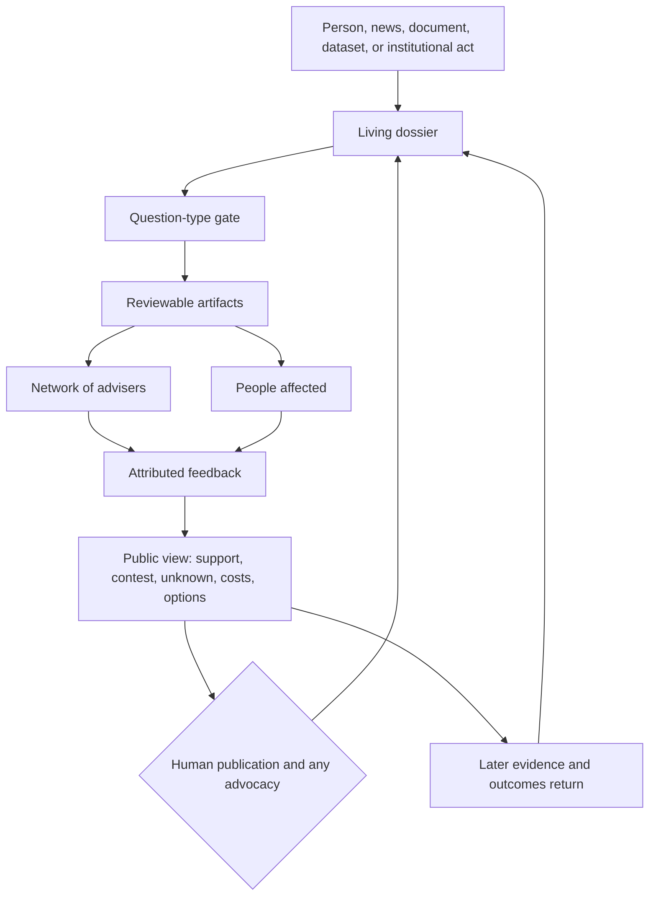

# Kavian — stitched architecture for the next design cycle

**Date:** 22 September 2026  
**Status:** The design circulation. The finished presentation is [`proposal-deck.html`](./proposal-deck.html); this file is not the slide script. It does not record a deployed system or a recruited adviser network.  
**Reads with:** [working reference](./REFERENCE.md), [English concept](../concept/kavian-concept-en.md), [Persian concept](../concept/kavian-concept-fa.md)

The conversation arrived as separate pieces: a public purpose, a technical stack, a model layer, a network of advisers, and a way of sending artifacts out for criticism. This document is the joint. The current deck, and any later prototype or charter language, should be able to point back to this circulation and say which part they are testing.

## 1. The promise, as a test a person can apply

Kavian exists so a person can face a public decision with more than a headline and less than a verdict handed down from above.

A successful pass through the system leaves that person able to say:

- what is being claimed, and which sources support it today
- who benefits, who bears the cost, and whose experience is still missing
- where knowledgeable people disagree, and on what kind of question
- what the visible options are, and which costs and assumptions each one carries
- what would revise the account, and how to challenge it

The person still decides. Advisers deepen the picture. Models move work that has a defined shape. Kavian may later explain, propose, and advocate, and when it does, a named human owns that act.

The first community this must serve is people in Iran: access to evidence, a view of options, and a view of what a choice costs. The same circulation should be able to learn from other communities without making one place’s categories the measure of every other.

## 2. One circulation

Nothing in this loop is allowed to skip the question-type gate. A raw feed does not become a score. An adviser’s confidence does not become the public’s choice. A model’s probability does not become the probability that a life has been described fairly.

Six responsibilities share the loop. They are capacities, and a single organization chart must not collapse them into one operator.

| Responsibility | What it contributes | What it must not become |
|---|---|---|
| Public participation | Problems, lived experience, evidence, challenge, follow-up | A comment box with no effect on the record |
| Evidence and memory | Provenance, versions, corrections, consequences over time | An indelible dump of personal detail |
| Machines | Search, extraction, comparison, routing, drafts, traces | An authority because the work was systematic |
| Network of advisers | Knowledge, criticism, and considered judgment on the artifact in front of them | A final board, or a class set above the public |
| Publication and action | A readable account, options, and, where chosen, accountable advocacy | Speech on behalf of “the people” as a whole |
| Governance of Kavian | Rules, appeals, limits on founder, funder, and operator power | A hidden switch for what may be asked |

## 3. The question-type gate

Before an artifact is routed, scored, or placed in a Delphi round, the dossier names what kind of question is actually open. One subject often contains more than one kind. They stay labeled, because they are answered in different ways.

| Kind of question | What can move it | What stays with people |
|---|---|---|
| Credibility of a factual claim | Sources, method, replication, and a record of what the sources do not show | The right to introduce missing evidence and to contest the frame |
| Estimate under uncertainty | Structured judgment, stated assumptions, ranges, and sensitivity to those assumptions | The right to see the range and the assumptions, and to reject a false precision |
| Social or moral preference | Public participation, especially by people who live with the result | This is not an expert score. Advisers may clarify consequences. They do not cast the public’s values |
| Proposed action | A named human owner, stated reasons, expected costs, and a correction path | Whether to support, refuse, or amend the action |

This gate is the control plane for every tool named so far. Policy Delphi, multi-criteria comparison, and sensitivity analysis are procedures for when a dossier has reached estimates or options. They are a poor fit for a fresh news item that still lacks sources. A decision model of this kind, Jev or an open-weight peer such as Laya, if tested, sits inside predefined structured steps. It does not sit on the value row.

## 4. Artifacts

An artifact is a bounded object a person can answer. It is made from news, documents, datasets, and public accounts inside a living dossier. It is a unit of work, and the dossier remains revisable after it.

Possible forms, still unchosen as a final set:

- a claim and the evidence for and against it
- a timeline of promises, decisions, and observed results
- a comparison of conflicting accounts
- a list of open questions
- a sheet of options with stated costs, benefits, and who is missing

Minimum fields, proposed for the first prototype:

| Field | Why a person needs it |
|---|---|
| Dossier and version | So a later correction does not erase the earlier public account |
| Claim, in plain language | So the object of review is explicit |
| Question type | So a value conflict is not treated as a fact check |
| Sources, and what each source does not establish | So absence is visible |
| Uncertainty and open questions | So a clean layout cannot fake certainty |
| Who drafted it, human or agent | So machine assistance stays attributable |
| The question being asked of the reviewer | So advisers are not handed a raw pile and told to “give a view” |
| A challenge route | So affected people can enter without an adviser title |

Routing follows the question, the competence it requires, and the need for contrasting perspectives. Fame and closeness to the operators do not create a claim on the artifact. One artifact may go to one adviser or to several. Conflict of interest limits or removes a role on that artifact.

What comes back is attributed: agreement, objection, a missing source, a limit of the reviewer’s knowledge, or a rejection of the question itself. Feedback stays tied to the artifact and, where safety and privacy allow, to the evidence it addresses.

## 5. The network of advisers

Working name: **network of advisers** (*شبکهٔ مشاوران*). The name is meant to be ordinary. It recognizes that these people know their work. It does not rank them above the public, and it does not shrink them to a final stamp.

They may be researchers, economists, sociologists, writers, literary figures, public intellectuals, technical specialists, civic participants, and others whose knowledge or experience bears on the question. Difference of worldview is part of the design. A writer’s reading of public language and an economist’s reading of a budget can both be necessary, and they are not the same kind of authority.

Affected people have a separate door. Their account is evidence and context. It does not wait for someone to grant them the title of adviser.

A “complete view” means an honest account of what is known, contested, and unknown. It does not mean that every opinion has the same evidential weight, or that the system has seen everything.

## 6. Where machines are allowed to work

Kaveh has described the technical layer as a multi-agent system: LangChain and LangGraph for the flows; LangSmith and Langfuse for observability and evaluation; Vercel as the place it runs; GitHub as the place the code is kept; substantial observability work already done. That is his architectural account. This folder has not inspected the repository, the deployment, or the traces. Presentation language should keep that distinction.

Proposed agent jobs, as clerks with narrow tasks:

| Agent | Job | Stops where |
|---|---|---|
| Scribe | Intake, provenance, first artifact draft | It does not decide that a claim is true |
| Router | Match an artifact to question type and to relevant reviewers | It does not choose the public’s preference |
| Mirror | Place feedback side by side: support, contest, unknown, and the kind of disagreement | It does not average positions into one voice |
| Interpreter | Plain-language explanation, including Persian and later other languages | It does not replace the sourced artifact |
| Keeper | Versions, traces, and redaction | It does not publish private material in the name of transparency |

Language models, including open models where they fit, help search, extract, translate, compare, and explain. A different slot is a small model that only answers a fixed question and returns a probability: classification, routing, scoring against stated criteria, or flagging an item for human review. Jev, from TypeSafe, is a licensed hosted service with that ability. Laya is an open-weight model of the same kind. What matters is the ability, and the slot stays replaceable. Maker claims about speed, cost, and calibration remain untested on Kavian’s languages, data, and questions. A probability from either model is an output on a defined task. It is not a finding that a report is true, and it is not the best decision for a people.

Observability, for this project, answers a civic question: which source version, which agent, which model, which human edit, which disagreement, and which later correction produced the account a person is reading. The same record can harm people if it exposes a vulnerable contributor, private evidence, or a security-sensitive detail. The public trace, the adviser trace, and the overseer trace are different views of one history. What each may see is still a design question. A useful default is to preserve the history of institutional claims and of substantive corrections, and to refuse permanence for personal detail that is not required for accountability.

Open components support a hope of inspection and replacement. They do not, by themselves, make Kavian independent, neutral, or audited. LangChain and LangGraph are open-source. Langfuse’s core is open-source and self-hostable, with commercial features around it. LangSmith’s client SDK is open-source; the LangSmith platform should not be described as open-source. Vercel, GitHub, and Jev are external services. Laya’s weights can be run where the text must stay, and open weights are still not an audit of the system around them. Independence has to be shown in replaceable parts, visible decisions, data governance, and a way to contest the operators.

## 7. What the person receives

The public view of a dossier, proposed as the object the presentation must be able to show:

1. **For now, the evidence supports…** with sources and claim type.
2. **This is contested…** with each position, its reason, and whether the dispute is about data, interpretation, or values.
3. **This is still unknown…** including whose experience has not been heard.
4. **Who benefits, who pays, who is missing.**
5. **Options, if the dossier has reached them…** each with criteria, assumptions, and how sensitive the comparison is to those weights.
6. **What would revise this account.**
7. **How to challenge it,** including a path that does not require becoming an adviser.
8. **If Kavian proposes or supports an action…** the human owner, the reasons, the possible harm, and the correction path.

Disagreement that survives scrutiny stays visible. Agreement after scrutiny is allowed. Manufactured dissent is not a requirement for publication. Silence from people who were never invited is not agreement.

## 8. A fictional miniature, to see the joint

This scene is an illustration of the circulation. It is not a Kavian finding, not a claim about a real city, and not the required subject of the presentation. Water remains an early example in the archive, not the definition of the service.

> A transit authority announces a fare increase and says the money will keep routes running. Riders report that service to outlying districts has already thinned. A budget table and a timetable do not tell the same story.

The question-type gate splits the subject:

- **Factual:** what the budget line says, what the timetable says, what riders report, and where those records conflict.
- **Estimate:** what service level is likely next year under the published plan, with a range and named assumptions.
- **Value:** whether that distribution of cost and access is acceptable. Advisers can illuminate it. They do not settle it.
- **Action:** any later proposal — for example, to demand the missing route data — has a human owner.

Artifacts: a claim card for the official justification, a comparison card for budget versus timetable versus rider accounts, an open-question list (who lost trips, which districts, what was promised last year).

The comparison card goes to three advisers: someone who can read a public budget, someone who knows transport operations, and someone who can say whether the public language hides the cut. A rider from an affected district can submit the missing experience without joining that trio. The Mirror agent lays their responses side by side. If they disagree about the arithmetic, that is an evidence problem. If they disagree about whether a longer walk is an acceptable price, that is a value problem, and it stays labeled as one.

A decision model, in this miniature, may only help route the cards or flag that the budget and the timetable disagree on a predefined check. Jev or Laya could fill that step. Neither may score the value question. The Interpreter writes the public view in plain language. The Keeper stores the version the public saw, and the later version if the authority replies. A person reading the view can tell what is sourced, what is estimated, what is a value conflict, and how to add a correction.

## 9. Powers this design still has

Choosing which questions are opened, which artifacts are sent, which advisers are invited, which model is allowed to route, and which sentence leads the public view are all exercises of power. The honest commitment is to limit that power, show how it was used, and give people a real way to contest it.

Risks to design against in the next cycle:

- The adviser network becomes a soft veto by a familiar circle.
- A confident model output is read as a finding about the world.
- Observability is used to expose the people the archive was meant to protect.
- “Open source” is offered as proof of independence while deployments, data, and emergency decisions sit with a few operators.
- A fluent summary erases a serious disagreement.
- Success is counted as attention, while understanding, remedy, and harm are never checked.
- Permanent memory makes a person’s private detail harder to repair than the institution’s decision.

Kavian should also be able to record repair: a promise kept, a correction accepted, a cooperation that reduced harm. A public memory that can only narrate failure teaches people that nothing they do will count.

## 10. What the presentation may say

| May be said | Must stay qualified |
|---|---|
| Kavian is a design for public understanding, oversight, and the capacity to choose | It is not yet shown here as a live service with measured public effect |
| Advisers review artifacts and their disagreements stay visible | Recruitment, pay, selection, and appeal rules are undesigned |
| The intended stack is multi-agent, observable, and meant to be replaceable | Repository, deployment, and trace quality have not been inspected in this folder |
| A decision model is a candidate for bounded structured steps, beside language models. Jev is hosted. Laya is open weights | It is not the brain of the system. Open weights are not an audit, and neither model has been tested on Kavian’s Persian text |
| Policy Delphi, structured elicitation, multi-criteria comparison, and sensitivity analysis are methods worth testing | None of them is an implemented decision procedure |

The audience for The New Centre, as inferred from the application, cares whether a system can be asked a better question than the one it was given. The stitched architecture is a proposal for where that interruption lives: at the question-type gate, in the artifact a person can challenge, in the preserved disagreement, and in the trace of how the account changed.

## 11. Next design slices

These are the next pieces of work in this folder. They are ordered so the presentation can become concrete before the unbuilt machinery is described as if it were running.

1. **Choose the illustrative issue** for a public-view specimen. Criteria: one decision a non-specialist can feel; at least two conflicting records; a visible cost; a missing voice; a value question that must stay with people. The miniature in Section 8 can be replaced once the issue is chosen.
2. **Freeze a first artifact schema** from the fields in Section 4, plus the adviser return: stance, reason, what would change the reviewer’s mind, conflict note, and whether the question itself is refused.
3. **Write the question-type gate as rules** an agent and a human steward would both follow, including which question types a decision model is forbidden to score.
4. **Write the trace and redaction matrix:** public, adviser, and overseer views; what is kept forever; what can be withdrawn when a person would be harmed.
5. **Only then draft the presentation narrative,** using the through-line already sketched in the [reference](./REFERENCE.md): lived problem, design question, this circulation, the powers it still holds, and the research question of whether the system can change its own frame.

Until those slices exist, new tool names should be added here as candidates, with the same status discipline, rather than opened as a separate story.
